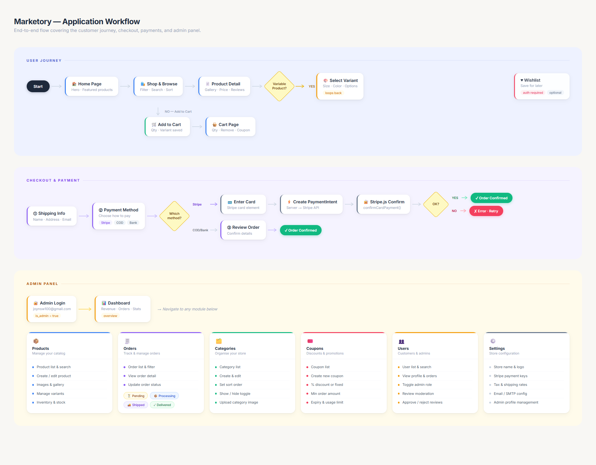

# Marketory

A full-featured e-commerce web application built with Laravel 12 and Livewire 4. Marketory covers everything you'd expect from a modern online store — product browsing, variant selection, a session-based cart, Stripe payments, order management, wishlists, coupon codes, and a complete admin panel — all without a single page reload thanks to Livewire's reactive components.


---

## What's inside

This project started as a way to build a clean, maintainable e-commerce foundation using Laravel's latest conventions. Instead of reaching for a pre-built package, everything here is hand-crafted — the cart logic, the checkout flow, the admin panel, the variant system. That means you can read and understand every piece of it.

**The storefront** gives customers a filterable product catalog, full product detail pages with image galleries and reviews, a slide-out cart sidebar, and a three-step checkout that handles Stripe card payments, cash on delivery, and bank transfer in the same flow.

**The admin panel** lives under `/admin` and lets you manage products (including variable products with size/colour/etc. variants), track and update orders, manage categories, create discount coupons, moderate reviews, and manage user accounts.

---

## Tech stack

| Layer       | Technology                                       |
| ----------- | ------------------------------------------------ |
| Backend     | PHP 8.2 · Laravel 12                             |
| Reactive UI | Livewire 4.2                                     |
| Frontend    | Bootstrap 5.3 · Sass · Vite 7                    |
| Database    | SQLite (default) — swap to MySQL/Postgres easily |
| Payments    | Stripe PHP SDK 19 · Stripe.js v3                 |
| Slugs       | Spatie Laravel Sluggable                         |
| Auth        | Laravel's built-in authentication                |

---

## Features

### Customer-facing

- **Product catalog** — search, filter by category, filter by price range, sort by newest / price / name, paginate, in-stock toggle
- **Product detail pages** — image gallery with thumbnail switcher, star ratings, reviews tab, size/colour variant picker, quantity selector, stock status badge
- **Variable products** — products can have any number of attribute types (size, colour, material, etc.) with individual variant pricing and stock levels
- **Session cart** — add to cart from the catalog or product page, adjust quantities, remove items, apply coupon codes — all persisted in the session, no login required
- **Slide-out cart sidebar** — opens automatically when you add something, shows a live item count badge in the navbar
- **Wishlist** — save products for later, requires login, toggle on/off from the product detail page
- **Three-step checkout**
    1. Shipping info (name, address, email)
    2. Payment method (Stripe card, cash on delivery, bank transfer)
    3. Review and confirm
- **Stripe payments** — card element mounts on step 3, creates a PaymentIntent server-side, confirms with Stripe.js, verifies server-side before creating the order
- **Order confirmation** — unique order number, full item summary, billing details
- **User accounts** — register, login, logout, view order history

### Admin panel (`/admin`)

- **Dashboard** — at-a-glance stats (total orders, revenue, products, users)
- **Product management** — full CRUD, rich description editor, image uploads, sale pricing, featured flag, SEO fields
- **Variant & inventory manager** — add/remove variants, set prices and stock per variant, track low stock
- **Order management** — list with status filters, full order detail view, update order status (pending → processing → shipped → delivered → cancelled)
- **Category management** — create, edit, reorder, show/hide categories
- **Coupon management** — percentage or fixed discounts, minimum order amounts, usage limits, expiry dates
- **User management** — view all users, toggle admin role
- **Review moderation** — approve or reject customer reviews

---

## Project structure

```
app/
├── Http/Controllers/
│   ├── AuthController.php       # Login, register, logout
│   └── HomeController.php       # Homepage with featured products
├── Livewire/
│   ├── Cart/
│   │   ├── CartIcon.php         # Navbar badge (live item count)
│   │   ├── CartSidebar.php      # Slide-out offcanvas cart
│   │   └── CartPage.php         # Full cart page with qty controls
│   ├── Shop/
│   │   ├── ProductCatalog.php   # Filterable/paginated product grid
│   │   └── ProductDetail.php    # Product page (variants, qty, wishlist)
│   ├── Checkout/
│   │   └── CheckoutForm.php     # 3-step checkout + Stripe integration
│   ├── Wishlist/
│   │   └── WishlistPage.php     # Wishlist page
│   └── Admin/
│       ├── Dashboard.php
│       ├── Products/
│       │   ├── ProductList.php
│       │   ├── ProductForm.php
│       │   └── InventoryManager.php
│       └── Orders/
│           ├── OrderList.php
│           └── OrderDetail.php
├── Models/
│   ├── User.php
│   ├── Category.php
│   ├── Product.php              # Accessors: effective_price, is_on_sale, stock_status
│   ├── ProductImage.php
│   ├── ProductVariant.php       # variantAttributes() relationship (not attributes())
│   ├── AttributeType.php        # e.g. "Size", "Colour"
│   ├── Attribute.php            # e.g. "Large", "Red"
│   ├── Order.php
│   ├── OrderItem.php
│   ├── Coupon.php
│   ├── Review.php
│   └── Wishlist.php
└── Services/
    ├── CartService.php          # Session-based cart (add, remove, qty, coupon, totals)
    └── OrderService.php         # Creates orders from cart, handles payment intent
```

---

## Getting started

### Requirements

- PHP 8.2 or higher
- Composer
- Node.js 18+ and npm
- SQLite (built into PHP — no setup needed)

### Installation

**1. Clone the repo**

```bash
git clone https://github.com/your-username/marketory.git
cd marketory
```

**2. One-command setup**

```bash
composer run setup
```

This single command installs PHP dependencies, copies `.env.example` to `.env`, generates your app key, runs all migrations, installs npm packages, and builds the frontend assets.

**3. Seed the database**

```bash
php artisan db:seed
```

This creates sample categories, products with variants and images, coupon codes, reviews, and user accounts (see the [Default accounts](#default-accounts) section below).

**4. Start the development server**

```bash
composer run dev
```

This starts everything you need in parallel: the Laravel dev server on port 8003, the queue worker, log tailing with Pail, and Vite's hot-reload dev server.

Open **http://localhost:8003** in your browser.

---

## Environment variables

Copy `.env.example` to `.env` and update the values you need. The defaults work out of the box for local development with SQLite.

```env
APP_NAME=Marketory
APP_URL=http://localhost:8003

# Database — SQLite by default, no configuration needed
DB_CONNECTION=sqlite

# Stripe — required for card payments
# Get your keys from https://dashboard.stripe.com/apikeys
STRIPE_KEY=pk_test_...          # publishable key  (starts with pk_)
STRIPE_SECRET=sk_test_...       # secret key       (starts with sk_)
VITE_STRIPE_KEY="${STRIPE_KEY}" # exposes the publishable key to the browser
```

> **Important:** `STRIPE_KEY` must be your **publishable** key (starts with `pk_test_`). `STRIPE_SECRET` must be your **secret** key (starts with `sk_test_`). Never swap these around — the app will warn you in the browser console if you get it wrong.

---

## Default accounts

After running `php artisan db:seed`, the following accounts are ready to use.

### Admin accounts

| Name  | Email               | Password              |
| ----- | ------------------- | --------------------- |
| Admin | admin@marketory.com | `password`            |
| Joy   | joynsw100@gmail.com | `joynsw100@gmail.com` |

Log in at `/login` and you'll be redirected to `/admin/dashboard` automatically.

### Customer accounts

All dummy customers use the password `password`.

| Name          | Email             |
| ------------- | ----------------- |
| Alice Johnson | alice@example.com |
| Bob Smith     | bob@example.com   |
| Carol White   | carol@example.com |
| David Brown   | david@example.com |
| Emma Davis    | emma@example.com  |
| Frank Miller  | frank@example.com |
| Grace Wilson  | grace@example.com |
| Henry Moore   | henry@example.com |
| Isla Taylor   | isla@example.com  |
| Jack Anderson | jack@example.com  |

---

## Key URLs

| URL                      | Description                         |
| ------------------------ | ----------------------------------- |
| `/`                      | Storefront homepage                 |
| `/shop`                  | Product catalog with filters        |
| `/product/{slug}`        | Product detail page                 |
| `/cart`                  | Shopping cart                       |
| `/checkout`              | Three-step checkout                 |
| `/wishlist`              | Saved products (login required)     |
| `/login`                 | Login page for customers and admins |
| `/register`              | New customer registration           |
| `/admin`                 | Admin dashboard                     |
| `/admin/products`        | Product list and management         |
| `/admin/products/create` | Add a new product                   |
| `/admin/orders`          | Order list with status filters      |
| `/admin/orders/{id}`     | Order detail and status update      |
| `/workflow.html`         | Visual application workflow diagram |

---

## Testing Stripe payments

Use Stripe's test card numbers in the checkout. No real money is involved.

| Scenario           | Card number           | Expiry          | CVC          |
| ------------------ | --------------------- | --------------- | ------------ |
| Successful payment | `4242 4242 4242 4242` | Any future date | Any 3 digits |
| Card declined      | `4000 0000 0000 0002` | Any future date | Any 3 digits |
| Requires 3D Secure | `4000 0025 0000 3155` | Any future date | Any 3 digits |

---

## Database schema

The database has 16 tables covering the full e-commerce domain.

```
users                        — customers and admin accounts (is_admin flag)
categories                   — product categories with slugs and sort order
products                     — main product table (supports simple & variable)
product_images               — multiple images per product with sort order
attribute_types              — e.g. "Size", "Colour", "Material"
attributes                   — e.g. "Large", "Red", with optional colour hex
product_variants             — a specific combination of attributes on a product
product_variant_attributes   — pivot: which attributes belong to which variant
orders                       — order header with billing, shipping, payment info
order_items                  — individual line items per order
coupons                      — discount codes (percentage or fixed amount)
reviews                      — customer reviews with approval workflow
wishlists                    — saved products per user
cache                        — Laravel cache table storage
sessions                     — database session storage
jobs                         — queue job storage
```

---

## How the cart works

The cart is entirely session-based — no database table required, no login needed. `CartService` stores a structured array in the session under the key `marketory_cart`.

Each item is keyed by `{product_id}-{variant_id}` so the same product in different sizes or colours is tracked as separate line items. The service handles subtotals, coupon discounts, shipping (free over $50, otherwise $5.99), and 8% tax. When the customer places an order, `OrderService` reads from `CartService`, writes the `Order` and `OrderItem` records, and clears the cart.

---

## How Stripe works

Card details never touch your server. The flow is:

1. Customer reaches step 3 (Review). Stripe's card element mounts in the browser via Stripe.js.
2. Customer clicks **Pay**. The browser calls `createPaymentIntent` on the Livewire component.
3. The server creates a `PaymentIntent` via the Stripe API and returns a `client_secret`.
4. Stripe.js calls `confirmCardPayment()` in the browser using the client secret and the mounted card element.
5. On success, the browser calls `finalizeStripeOrder()` with the `paymentIntent.id`.
6. The server retrieves the PaymentIntent from Stripe, verifies its status is `succeeded`, then creates the order.

---

## Variable products

Products can be simple (one price, one stock count) or variable (multiple variants with individual prices and stock levels).

Variable products use a flexible attribute system. You define `AttributeType` records like "Size" or "Colour", then `Attribute` records like "Small / Medium / Large" or "Red / Blue / Green". A `ProductVariant` is then a specific combination of those attributes linked through the `product_variant_attributes` pivot table.

> **Note for contributors:** The relationship on `ProductVariant` is named `variantAttributes()`, not `attributes()`. This is intentional — Eloquent uses `$this->attributes` internally to store its raw data array, so naming a relationship `attributes()` causes a fatal conflict that produces `Call to a member function map() on array`. Keep it as `variantAttributes()` everywhere and update any eager loads accordingly.

---

## Useful commands

```bash
# Full setup from scratch
composer run setup
php artisan db:seed

# Start development (server + queue + logs + vite, all at once)
composer run dev

# Re-seed without dropping tables (safe to run multiple times)
php artisan db:seed

# Fresh database + seed (wipes everything)
php artisan migrate:fresh --seed

# Seed only users
php artisan db:seed --class=UserSeeder

# Build frontend for production
npm run build

# Run tests
composer run test

# Interactive console
php artisan tinker
```

---

## What's not included yet

A few things you'd want before going to production:

- **Email notifications** — the mail driver is set to `log` by default. Configure SMTP or a service like Resend/Postmark to send real order confirmation emails.
- **File uploads** — the product image system stores URLs. You'd want to add actual file upload handling (Laravel's filesystem + S3 or similar).
- **Stripe webhooks** — there's no webhook endpoint. For production you'd want to handle `payment_intent.succeeded` and `payment_intent.payment_failed` to keep order status reliable even if the browser closes.
- **Better search** — the current search is a simple `LIKE` query. For a larger catalog, Laravel Scout with MeiliSearch or Typesense would be a better fit.
- **Feature tests** — PHPUnit is set up but the test suite is empty. A good starting point would be tests for the CartService and the checkout flow.

---

## License

MIT — do whatever you want with it.
